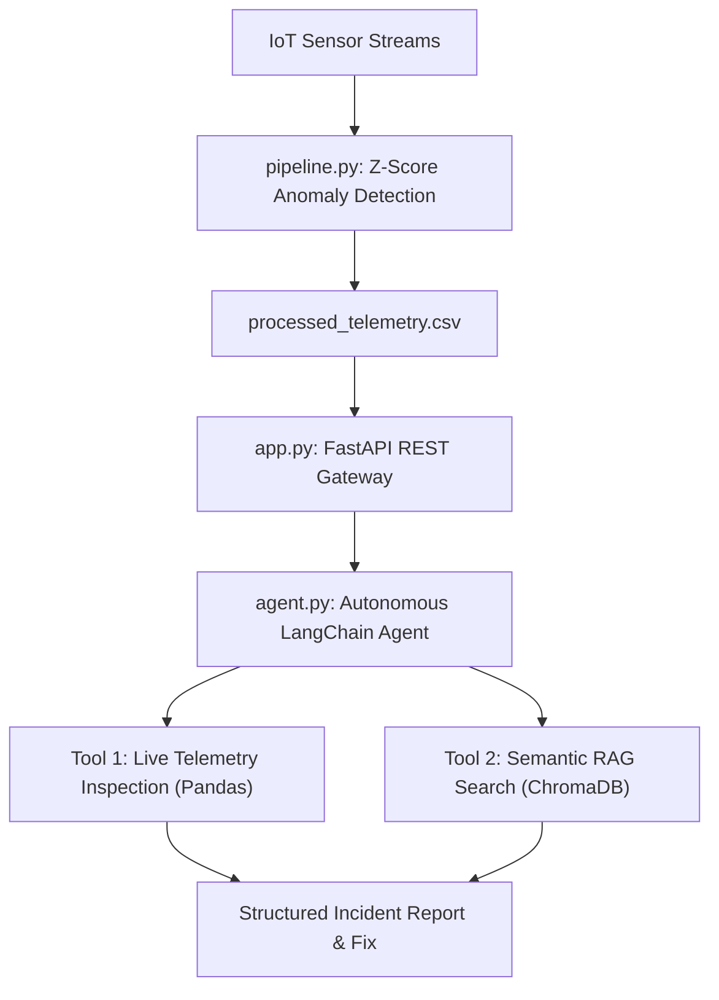

# ⚡ Autonomous IoT Diagnostic Agent & Telemetry Microservice

An end-to-end data engineering pipeline and autonomous agentic AI microservice built with **Python, Pandas, ChromaDB, LangChain, and FastAPI**.

The system ingests multi-sensor IoT time-series logs, detects operational anomalies using rolling statistical thresholding, and autonomously coordinates multi-tool diagnostic workflows using a live LLM agent to inspect live telemetry and query technical repair manuals.

---

## 🏗️ System Architecture



---

## 🚀 Key Features

- **Time-Series Data Engineering:** Ingests high-frequency sensor readings (temperature, vibration, pressure) and performs missing-value imputation via forward-fill strategies.
- **Statistical Anomaly Detection:** Calculates per-device rolling-window moving averages and dynamic standard deviations to detect operational anomalies via Z-score thresholding ($|Z| > 2.5$).
- **Semantic RAG Knowledge Base:** Chunks and indexes technical OEM troubleshooting and repair manuals into a local **ChromaDB** vector store for semantic similarity search.
- **Autonomous Tool-Calling Agent:** Powered by **Meta Llama 3 / open-weights LLMs via Groq**, autonomously selecting and chaining tools via native tool calling to diagnose root causes and recommend OEM fixes.
- **Production REST API Microservice:** Built on **FastAPI** and **Uvicorn**, featuring automated OpenAPI/Swagger documentation (`/docs`) and typed **Pydantic** request/response validation.

---

## 🛠️ Tech Stack

- **Backend & APIs:** FastAPI, Uvicorn, Pydantic
- **AI & Agentic Orchestration:** LangChain, ChromaDB (Vector Store), Groq API
- **Data Engineering:** Python 3.13, Pandas, NumPy, Time-Series Analysis

---

## 📦 Project Structure

```text
├── pipeline.py          # Time-series simulation, data cleaning & anomaly detection
├── agent.py             # LangChain autonomous agent with ChromaDB RAG & tool calling
├── app.py               # FastAPI REST microservice exposing /diagnose endpoints
├── schemas.py           # Pydantic data schemas for API requests & incident reports
├── .env                 # Environment variables (API keys - excluded from Git)
└── README.md            # Project documentation
```

---

## 🔌 API Endpoints

| Method | Endpoint | Description |
| :--- | :--- | :--- |
| `GET` | `/` | Microservice health check and endpoint directory. |
| `GET` | `/telemetry/anomalies` | Returns all records flagged as statistical anomalies by the pipeline. |
| `POST` | `/diagnose` | Triggers the autonomous LangChain Agent to inspect a device and generate an incident report. |

---

## 💻 Installation & Usage

### 1. Clone the Repository
```bash
git clone https://github.com/Veekshith2070/iot-telemetry-pipeline.git
cd iot-telemetry-pipeline/Iot-Telemetry-Pipeline
```

### 2. Install Dependencies
```bash
pip install pandas numpy langchain langchain-community langchain-core langchain-text-splitters langchain-groq chromadb fastapi uvicorn python-dotenv pydantic
```

### 3. Configure API Key
Create a `.env` file in the project directory:
```env
GROQ_API_KEY=your_groq_api_key_here
```

### 4. Run the Data Pipeline
Generate and preprocess sensor telemetry data:
```bash
python pipeline.py
```

### 5. Start the Microservice API
Launch the FastAPI server:
```bash
python app.py
```
Open **`http://127.0.0.1:8000/docs`** in your browser to interact with the live Swagger UI and trigger autonomous diagnoses!